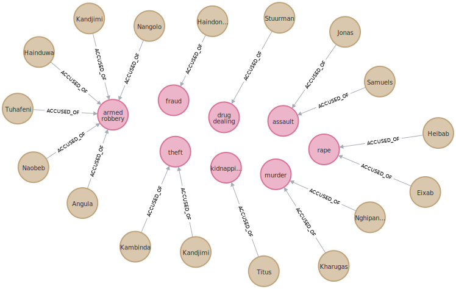

## Exercise: Crime Graph

Take the the court roll from the local newspaper and transform it into a graph visualizing the following relationships:

    * The court, the town (municipality), the region, the country
    * The individuals, their case info, and their court dates

Newspaper sampled (public record):

    Namib Times: Issue #6977 - FRIDAY 12 AUGUST 2022 - Page 4.

### Clean Start

```bash
# Due to a limitation of the community edition, you won't be able to create multiple DBs.
# To clear the current database first perform the following Cypher Query
MATCH (n) DETACH DELETE n
```

### Cypher Queries

```bash
# Either manually load in the entries like so
CREATE (person8:Person {
    case: '1',
    surname:'Surname',
    age:'21',
    court:'swakopmund',
    region:'erongo',
    case_state:'postponed',
    resumption:'00/00/00',
    accusation:'assault',
    outcome:'bail'
    })

# or import the data as CSV
cd /path/to/databases/neo4j/exercises/ex_crime
sudo docker cp courtroll.csv neo-dev:/var/lib/neo4j/import/courtroll.csv

# if you need to make some manual changes you can change to the container's tty like so
sudo docker exec -it neo-dev bash

# load the csv file in the browser editor
LOAD CSV WITH HEADERS FROM 'file:///courtroll.csv' AS row
MERGE (p:Person {surname: row.surname, age: row.age, case: row.case})
MERGE (a:Accusation {accusation: row.accusation})
MERGE (p)-[r:ACCUSED_OF]->(a)
```

### Resulting Graph Network



### Create More Nodes and Relationships

```bash
CREATE (:Region {name: 'Erongo'})
CREATE (:Municipality {name: 'Swakopmund'})
CREATE (:Court {name: 'Swakopmund Magistrates Court'})
CREATE (:Case_State {name: 'Postponed'})
CREATE (:Crime {name: 'Serious Crime'})
CREATE (:Crime {name: 'Petty Crime'})
CREATE (:Crime {name: 'Financial Crime'})
CREATE (:Outcome {name: 'Bail'})
CREATE (:Outcome {name: 'Custody'})
CREATE (:Outcome {name: 'Arrest Warrant'})

CREATE (:Accusation)

MATCH (a:Accusation {accusation: 'armed robbery'}), (l:Crime {name: 'Serious Crime'}) create (a) -[:CONSIDERED_A]-> (l)
MATCH (a:Accusation {accusation: 'robbery'}), (l:Crime {name: 'Serious Crime'}) create (a) -[:CONSIDERED_A]-> (l)
MATCH (a:Accusation {accusation: 'kidnapping'}), (l:Crime {name: 'Serious Crime'}) create (a) -[:CONSIDERED_A]-> (l)
MATCH (a:Accusation {accusation: 'murder'}), (l:Crime {name: 'Serious Crime'}) create (a) -[:CONSIDERED_A]-> (l)
MATCH (a:Accusation {accusation: 'rape'}), (l:Crime {name: 'Serious Crime'}) create (a) -[:CONSIDERED_A]-> (l)
MATCH (a:Accusation {accusation: 'fraud'}), (l:Crime {name: 'Financial Crime'}) create (a) -[:CONSIDERED_A]-> (l)
MATCH (a:Accusation {accusation: 'assault'}), (l:Crime {name: 'Petty Crime'}) create (a) -[:CONSIDERED_A]-> (l)
MATCH (a:Accusation {accusation: 'drug dealing'}), (l:Crime {name: 'Petty Crime'}) create (a) -[:CONSIDERED_A]-> (l)
MATCH (a:Accusation {accusation: 'theft'}), (l:Crime {name: 'Petty Crime'}) create (a) -[:CONSIDERED_A]-> (l)
```

