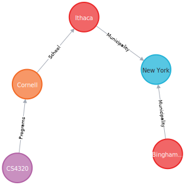

## Exercise: University Graph DB

  * Create a graph DB representing the following situation:
    * Ithaca and Binghamton are cities in New York State.
    * Cornell University is located in Ithaca
    * Corner offers a course with the name "CS4320"



```
# initialize empty node database
create ()

# create state nodes with name parameter of New York
create (:State {name: 'New York'})

# create city nodes with name parameters of Ithaca and Binghamton
create (:City {name: 'Ithaca'})
create (:City {name: 'Binghamton'})

# create a relationship between the city and the state it resides in
match (c:City), (s:State {name: 'New York'}) create (c) -[:Municipality]-> (s)

# create university node with name parameter of Cornell
create (:University {name: 'Cornell'})

# create a relationship between the Univeristy and the City it resides in
match (u:University {name: 'Cornell'}), (c:City {name: 'Ithaca'}) create (u) -[:School]-> (c)

# create course node with name parameter of CS4320
create (:Course {name: 'CS4320'})

# create a relationship between the Courses offered and the University offering said courses
match (k:Course {name: 'CS4320'}), (u:University {name: 'Cornell'}) create (k) -[:Programs]-> (u)
```

